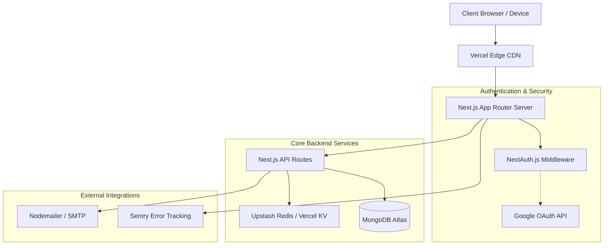
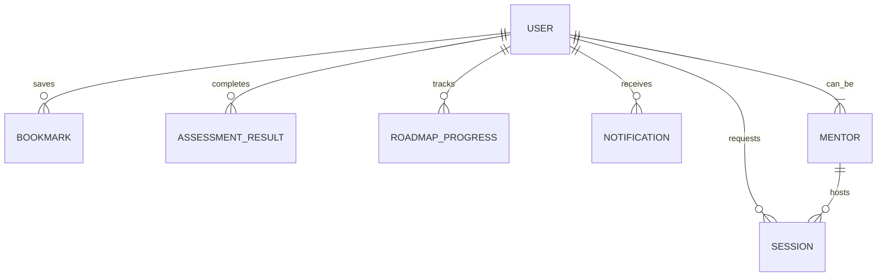

<div align="center">
  <h1 align="center">Entre Skill Hub</h1>
  <p align="center">
    <strong>A World-Class Platform for Entrepreneurial Skills & Mentorship</strong>
  </p>
  
  <p align="center">
    Entre Skill Hub is an enterprise-grade platform designed to accelerate entrepreneurial learning through personalized roadmaps, dynamic assessments, and high-quality mentorship connections. Built with modern web standards to ensure security, performance, and accessibility.
  </p>

  <p align="center">
    <a href="https://nextjs.org/"></a>
    <a href="https://react.dev/"></a>
    <a href="https://www.typescriptlang.org/"></a>
    <a href="https://www.mongodb.com/"></a>
    <a href="https://tailwindcss.com/"></a>
    <a href="https://ui.shadcn.com/"></a>
    <a href="#"></a>
    <a href="#"></a>
    <a href="#"></a>
    <a href="#"></a>
  </p>
</div>

<hr />

## 📑 Table of Contents

- [Project Overview](#-project-overview)
- [Key Features](#-key-features)
- [Screenshots](#-screenshots)
- [System Architecture](#-system-architecture)
- [Folder Structure](#-folder-structure)
- [Technology Stack](#-technology-stack)
- [Authentication Flow](#-authentication-flow)
- [Database Design](#-database-design)
- [API Documentation](#-api-documentation)
- [Environment Variables](#-environment-variables)
- [Installation](#-installation)
- [Development Workflow](#-development-workflow)
- [Testing](#-testing)
- [Performance & Security](#-performance--security)
- [Deployment](#-deployment)
- [Roadmap](#-roadmap)
- [Contributing](#-contributing)
- [Support & Authors](#-support--authors)

---

## 🎯 Project Overview

**Problem**: Aspiring entrepreneurs often lack structured guidance, facing an overwhelming sea of scattered resources and a high barrier to accessing experienced mentors.

**Solution**: Entre Skill Hub unifies customized learning paths, skill assessments, and expert mentorship into a single, cohesive ecosystem.

**Who it helps**: First-time founders, students, and professionals looking to build startups or develop an entrepreneurial mindset.

**Business value**: Accelerates the incubation process for startups, improving success rates by bridging the gap between theoretical knowledge and practical execution.

**Educational value**: Provides adaptive, highly structured learning roadmaps that respond to user progress rather than a one-size-fits-all curriculum.

**Expected impact**: To democratize elite-level entrepreneurial mentorship and education, producing highly capable founders worldwide.

---

## ✨ Key Features

### Authentication & Security
*   **Email Login**: Secure credentials management with bcrypt hashing.
*   **Google OAuth**: Frictionless sign-up/in via Google accounts (NextAuth).
*   **Session Management**: JWT-backed sessions with rotation and CSRF protection.
*   **Secure Password Reset**: Time-limited, encrypted reset tokens sent via email.

### Learning & Progress
*   **Personalized Roadmaps**: Dynamically generated skill trees based on user interests.
*   **Progress Tracking**: Visual indicators of completion rates and milestone achievements.
*   **Skill Assessment**: Interactive quizzes verifying knowledge retention and practical ability.

### Mentorship & Community
*   **Mentor Discovery**: Search and filter curated experts by domain and availability.
*   **Scheduling**: Request and manage 1-on-1 mentorship sessions seamlessly.
*   **Recommendations**: ML-inspired recommendations for relevant mentors and learning resources.

### User Experience (Dashboard)
*   **Analytics**: High-level overview of learning velocity and assessment scores.
*   **Notifications**: Real-time alerts for session approvals, new resources, and updates.
*   **Bookmarks**: Instantly save, categorize, and revisit valuable platform content.

### Administration
*   **User Management**: Full CRUD operations for platform users and mentors.
*   **Reports**: System-wide analytics on engagement and completion metrics.
*   **Monitoring**: Integrated Sentry tracking for performance and error telemetry.

---
## 🏗 System Architecture



---

## 📁 Folder Structure

```text
entre-skill-hub/
├── .github/                # GitHub Actions CI/CD workflows
├── docs/                   # Additional documentation
├── public/                 # Static assets (images, fonts, icons)
├── scripts/                # Database seeding and migration scripts
├── src/
│   ├── app/                # Next.js App Router (Pages & Layouts)
│   │   ├── (auth)          # Grouped authentication routes
│   │   ├── admin/          # Admin dashboard interface
│   │   ├── api/            # Backend REST API endpoints
│   │   ├── dashboard/      # Primary user workspace
│   │   └── roadmaps/       # Learning content paths
│   ├── components/         # Reusable React components (Shadcn, UI)
│   ├── domains/            # Domain-driven design modules
│   ├── lib/                # Utility functions, configs, and singletons
│   ├── models/             # Mongoose database schemas
│   └── types/              # Global TypeScript definitions
├── tests/                  # E2E and Integration test suites
├── .env.example            # Environment variables template
├── components.json         # Shadcn UI configuration
└── package.json            # Project dependencies and scripts
```

---

## 💻 Technology Stack

| Purpose | Technology | Version | Reason for Choosing |
|---------|-----------|---------|---------------------|
| **Framework** | Next.js | 16.2 | Unmatched SSR/SSG capabilities, App Router for modern nested layouts. |
| **UI Library** | React | 19.2 | Industry standard, massive ecosystem, hooks paradigm. |
| **Language** | TypeScript | 5.0 | End-to-end type safety, fewer runtime bugs, superior developer experience. |
| **Styling** | Tailwind CSS | 4.0 | Utility-first, incredibly fast styling, optimal bundle sizes. |
| **Components** | Shadcn UI | 4.13 | Beautifully designed, accessible, fully customizable unstyled components. |
| **Database** | MongoDB | 9.8 | Flexible schema design, highly scalable document store. |
| **Authentication** | NextAuth | 4.24 | Secure, batteries-included auth with broad OAuth provider support. |
| **Caching/State** | Upstash Redis| 1.38 | Extremely fast key-value store, perfect for rate limiting and session caching. |
| **Error Tracking** | Sentry | 10.67| Real-time error monitoring and performance profiling. |
| **Testing** | Playwright/Jest| Latest | Comprehensive coverage from unit to End-to-End user flows. |

---

## 🔐 Authentication Flow

1.  **Login**: Users initiate login via credentials or Google OAuth.
2.  **OAuth**: NextAuth handles the handshake with Google, verifying the identity.
3.  **Session & JWT**: A secure HttpOnly cookie containing a signed JWT is issued to the client.
4.  **Protected Routes**: Next.js Middleware checks for the presence and validity of the JWT before rendering protected pages.
5.  **Logout**: The session is destroyed server-side, and cookies are cleared.
6.  **Password Reset**: A secure token is generated, stored in Redis with an expiration, and emailed to the user for validation.

---

## 🗄️ Database Design

Major collections in the MongoDB database include:

*   **Users**: Core identity, roles, and profile metadata.
*   **Mentors**: Specialized profiles linked to users, detailing expertise and availability.
*   **Roadmaps**: Structured learning paths with modular nodes.
*   **Assessments**: Quiz data, questions, and user completion scores.
*   **Bookmarks**: References mapping users to saved resources.
*   **Sessions**: Scheduled mentorship meetings and their statuses.



---

## 🔌 API Documentation

Our RESTful API endpoints are structured within the Next.js `/api` route handlers.

| Method | Endpoint | Purpose | Authentication | Example |
|--------|---------|---------|----------------|---------|
| `POST` | `/api/auth/register` | Register a new user | None | `{"email": "user@example.com", "password": "..."}` |
| `GET`  | `/api/profile/me` | Fetch current user data | Required (JWT) | N/A |
| `GET`  | `/api/roadmaps` | List available roadmaps | Required (JWT) | `?category=marketing` |
| `POST` | `/api/bookmarks` | Save a new resource | Required (JWT) | `{"resourceId": "123", "type": "article"}` |
| `GET`  | `/api/mentors` | Fetch mentor directory | Required (JWT) | `?expertise=fundraising` |

---

## ⚙️ Environment Variables

Copy `.env.example` to `.env.local` and populate the following:

| Variable | Description | Required | Example |
|----------|-------------|----------|---------|
| `MONGODB_URI` | MongoDB connection string | Yes | `mongodb://localhost:27017/entre-hub` |
| `NEXTAUTH_URL` | Application base URL | Yes | `http://localhost:3000` |
| `NEXTAUTH_SECRET` | Secret for signing session JWTs | Yes | `super-secret-32-char-string` |
| `GOOGLE_CLIENT_ID` | OAuth Client ID from Google | No | `12345.apps.googleusercontent.com` |
| `UPSTASH_REDIS_REST_URL`| Redis REST API endpoint | Yes | `https://eu1-liberal-puma.upstash.io` |
| `SENTRY_DSN` | Sentry project DSN | No | `https://abc@sentry.io/123` |
| `EMAIL_PROVIDER_API_KEY`| API key for sending emails | Yes | `sk_live_...` |

---

## 🚀 Installation

Follow these steps to set up the development environment.

1.  **Clone the repository**:
    ```bash
    git clone https://github.com/your-org/entre-skill-hub.git
    cd entre-skill-hub
    ```

2.  **Install dependencies** (Using npm):
    ```bash
    npm install
    ```

3.  **Configure Environment**:
    ```bash
    cp .env.example .env.local
    ```
    *Open `.env.local` and fill in the required keys.*

4.  **Database Setup (Optional but recommended)**:
    Ensure you have a local instance of MongoDB and Redis running, or use cloud equivalents (MongoDB Atlas, Upstash).

---

## 🛠️ Development Workflow

We utilize a robust suite of npm scripts for development and CI.

*   `npm run dev`: Starts the Next.js development server with hot-reloading.
*   `npm run build`: Compiles the application for production deployment.
*   `npm run lint`: Analyzes code using ESLint according to `eslint.config.mjs`.
*   `npm run test`: Executes the complete unit and integration test suite.
*   `npm run coverage:report`: Generates comprehensive coverage metrics.
*   `npm run seed:test`: Injects dummy data into the database for testing UI components.
*   `npm run migrate`: Executes structural database schema migrations.

---

## 🧪 Testing

We believe in a rigorous testing strategy to ensure enterprise reliability.

*   **Unit Tests (Jest)**: Testing individual functions, utility scripts, and isolated React components.
*   **Integration Tests (Jest)**: Validating database interactions and API route behaviors.
*   **End-to-End Tests (Playwright)**: Simulating real user flows (login, taking assessments, booking mentors) across modern browsers.
*   **Coverage**: We maintain strict coverage thresholds enforced during the CI pipeline. Run `npm run coverage:report` to view current metrics.

---

## ⚡ Performance & Security

### Performance optimizations
*   **Next.js App Router**: Leveraging React Server Components (RSC) to drastically reduce client-side JavaScript.
*   **Server-Side Rendering (SSR)**: Delivering pre-rendered HTML for immediate Largest Contentful Paint (LCP).
*   **Caching**: Utilizing Vercel KV / Upstash Redis for expensive database queries and API responses.
*   **Image Optimization**: Automatic WebP conversion and lazy-loading via `next/image`.
*   **Code Splitting**: Route-based chunking ensures users only download code necessary for the current view.

### Security measures
*   **NextAuth.js**: Hardened, industry-standard authentication.
*   **CSRF & XSS Prevention**: Automatic escaping in React, enforced CSRF tokens on state-mutating requests.
*   **Password Hashing**: `bcryptjs` with high work factors.
*   **Rate Limiting**: IP-based throttling via Redis middleware to prevent brute-force attacks.
*   **Environment Secrets**: Strictly isolated environments; secrets are never leaked to the client bundle.

### Accessibility (a11y)
*   **Keyboard Navigation**: Full support across all interactive Shadcn UI components.
*   **ARIA Attributes**: Screen-reader friendly semantic HTML following WCAG 2.1 AA standards.

---

## 🚢 Deployment

### Vercel (Recommended)
The platform is optimized for zero-configuration deployment on Vercel.
1.  Push your code to a GitHub repository.
2.  Import the repository into Vercel.
3.  Add all variables from your `.env.local` into the Vercel Environment Variables settings.
4.  Click **Deploy**.

### Docker
1. Build the image: `docker build -t entre-skill-hub .`
2. Run the container: `docker run -p 3000:3000 --env-file .env.local entre-skill-hub`

### Self-Hosted (Node.js)
1. Run `npm run build`
2. Set `NODE_ENV=production`
3. Run `npm run start`

### Production Checklist
- [ ] Ensure all environment variables are securely set.
- [ ] Verify MongoDB Atlas IP access lists.
- [ ] Enable Upstash Redis eviction policies.
- [ ] Test NextAuth callback URLs in production.
- [ ] Verify Nodemailer SMTP credentials.

### CI/CD
Our `.github/workflows` automatically handle:
- **Lint**: Runs ESLint and Prettier formatting checks.
- **Test**: Executes all Jest unit and integration tests.
- **Build**: Compiles the Next.js application to check for build errors.
- **Deploy**: Main branch merges trigger an automatic production build on Vercel.

---

## 🗺️ Roadmap

**Short-term (Next 3 Months)**
*   [ ] Refine Mentor matching algorithms.
*   [ ] Launch interactive coding/business assessments.
*   [ ] Implement Dark Mode across all UI components.

**Mid-term (6-12 Months)**
*   [ ] Introduce **AI Mentor** chatbot trained on successful startup case studies.
*   [ ] Integrated WebRTC video calls for mentorship sessions.
*   [ ] verifiable Certificates of Completion on the blockchain.

**Long-term & Future Features**
*   [ ] Micro-communities and cohort-based learning.
*   [ ] Global Leaderboards and gamification.
*   [ ] Native iOS & Android Mobile Apps (React Native).
*   [ ] In-house Startup Incubator portal for securing seed funding.

---

## 🤝 Contributing

We welcome contributions from the open-source community! 

1.  **Fork** the repository.
2.  **Create a branch**: `git checkout -b feature/amazing-feature`.
3.  **Commit your changes**: `git commit -m 'feat: Add amazing feature'`.
4.  **Push to the branch**: `git push origin feature/amazing-feature`.
5.  **Open a Pull Request**.

### Code Standards
*   **ESLint & Prettier**: Code must pass all automated linting checks.
*   **Naming Conventions**: `camelCase` for variables/functions, `PascalCase` for React components.
*   **Folder Conventions**: Keep components co-located with their respective domains when possible.

---

## ⚖️ License

This repository is strictly **Proprietary**. Unauthorized copying, modification, distribution, or use is strictly prohibited without explicit permission.

---

## 👥 Authors & Support

**Authors**
*   The Entre Skill Hub Core Team

**Acknowledgements**
*   Massive thanks to the open-source creators behind Next.js, Shadcn UI, and Tailwind CSS.

**Support**
*   **GitHub Issues**: For bug reports and feature requests.
*   **Discussions**: For architectural proposals and Q&A.
*   **Email**: support@entreskillhub.com

---

<div align="center">
  
### Repository Statistics

| ⭐ Stars | 🍴 Forks | 🐛 Issues | 🔀 Pull Requests | 👥 Contributors |
|:---:|:---:|:---:|:---:|:---:|
| [](https://github.com/your-org/entre-skill-hub) | [](https://github.com/your-org/entre-skill-hub) | [](https://github.com/your-org/entre-skill-hub/issues) | [](https://github.com/your-org/entre-skill-hub/pulls) | [](https://github.com/your-org/entre-skill-hub/graphs/contributors) |

</div># EntreSkill-Hub
# EntreSkill-Hub
# EntreSkill-Hub
